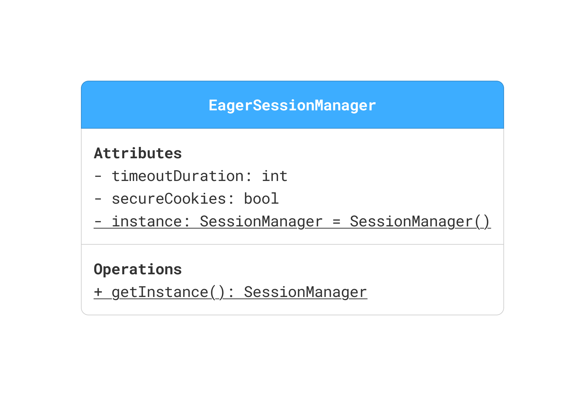
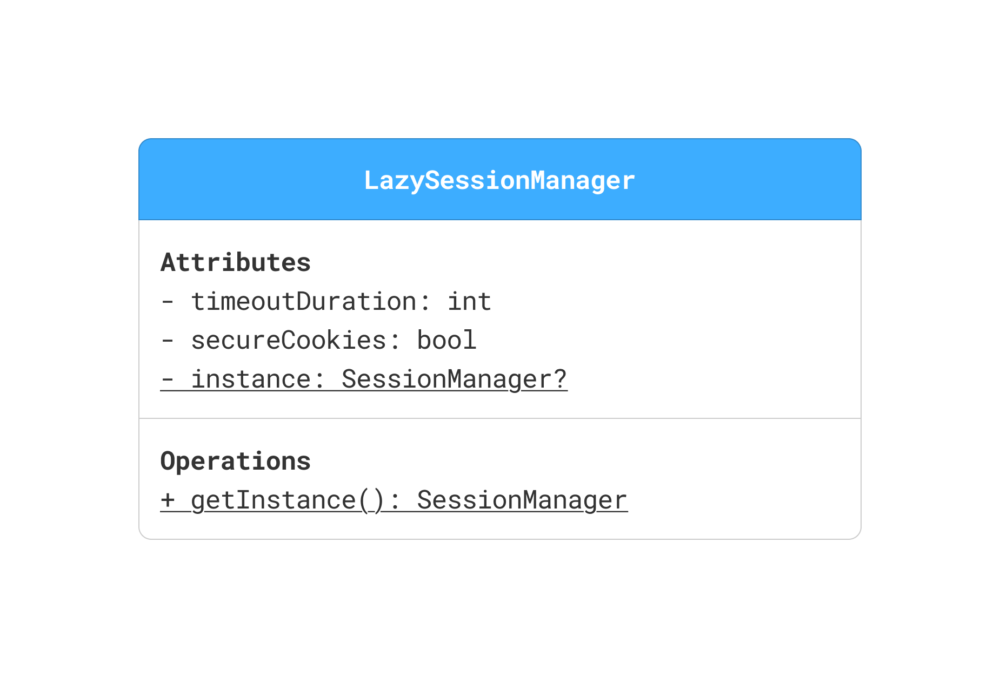

## 🧭 Eager Singleton - Session Manager
- When the singleton instance is **always needed** during app lifecycle.
- Useful when the instance is **lightweight**, and its early creation does not impact performance.

---
## 🧭 Lazy Singleton - Session Manager
- When the singleton instance is **only needed conditionally** or late in the app lifecycle.
- Helps **save resources** by delaying initialization until the first use.
- In **multi-threaded languages like Java**, we must add synchronization or use patterns like **double-checked locking** or the **`volatile` keyword** to
 ensure thread safety during lazy initialization.

