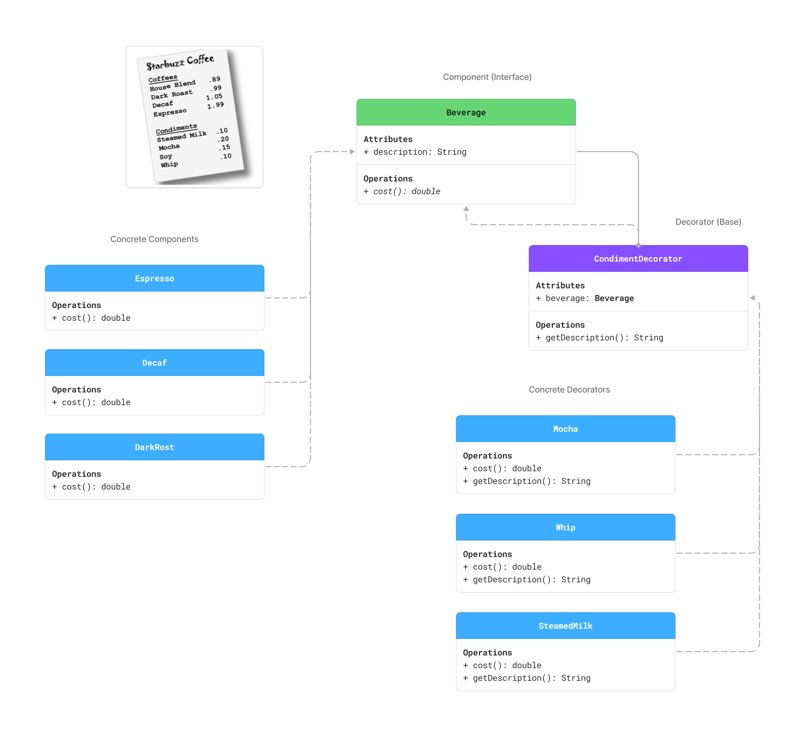
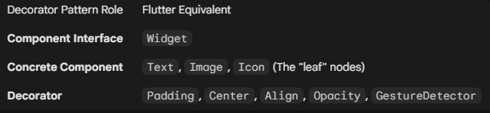

# Decorator Pattern Summary: Starbuzz Coffee

markdown


### 1. The Problem: Class Explosion
We needed to model beverages (Espresso, Decaf) with various combinations of condiments (Mocha, Whip, Soy).
* **Failed Approach:** Creating a subclass for every combination (e.g., `DecafWithMochaAndWhip`) leads to thousands of classes.
* **Rigidity:** Changing the price of "Whip" would require modifying dozens of classes.

### 2. The Solution: Composition over Inheritance
Instead of inheriting behavior, we **compose** objects at runtime. We "wrap" the main beverage with decorators that add new behavior (cost/description).
* **Design Principle:** *Classes should be open for extension, but closed for modification (OCP).*

### 3. Architecture & Roles
* **Component (`Beverage`):** The common interface for both the base coffee and the decorators.
* **Concrete Component (`Espresso`):** The base object being wrapped.
* **Decorator (`CondimentDecorator`):**
    * **Is-a Beverage:** It implements the `Beverage` interface so it can replace the original object.
    * **Has-a Beverage:** It holds a reference to the next object in the chain.

### 4. Dart 3 Implementation Highlights
We utilized modern Dart features to enforce structural integrity:

* **`abstract interface class Beverage`**: Defines a strict contract (API) without implementation.
* **`abstract base class CondimentDecorator`**: Enforces inheritance. It centralizes the `beverage` field, keeping the code DRY.
* **`final class Mocha`**: Prevents further subclassing. This forces developers to use *wrapping* (composition) instead of inheritance to add more features.
* **`super.beverage`**: Uses "Super Parameters" for clean, boilerplate-free constructors.


*Illustration of how the Decorator Pattern is applied in a Flutter context.*



```dart
// Example: Flutter Decorator Usage [Manual Instantiation]
Padding(
  padding: EdgeInsets.all(16),
  child: Container(
    color: Colors.blue,
    child: Text("Hello"),
  ),
)
```


```swift
// Example: SwiftUI Decorator Usage [Fluent Chaining (Builder-style syntax)]
Text("Hello")
  .background(Color.blue)
  .padding(16)
```