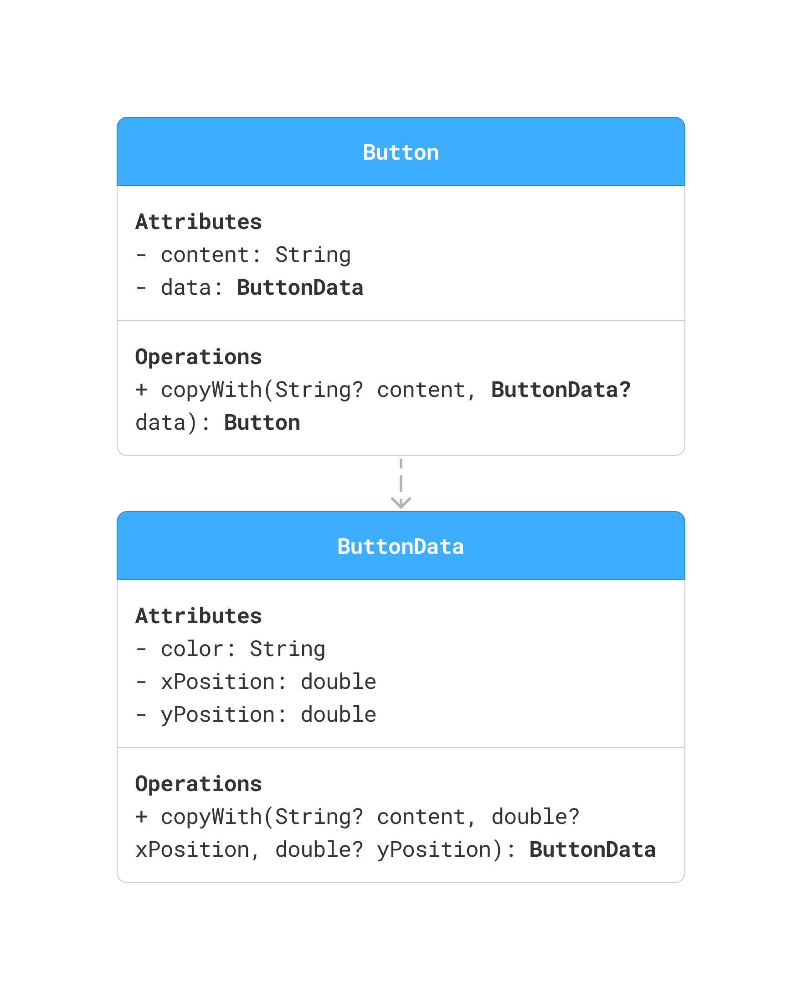
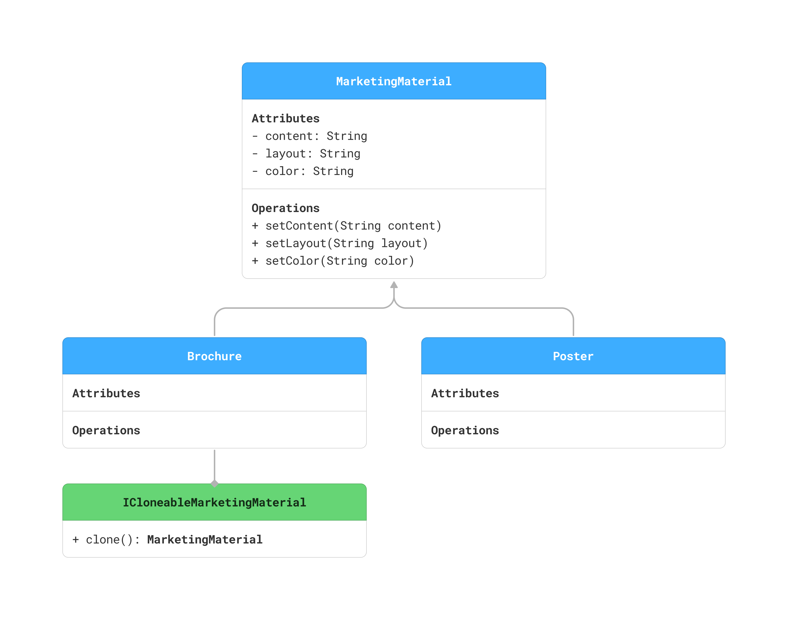

## 🧭 Prototype Pattern with `copyWith` — Button Example
✅ Best for:
- Immutable objects
- Declarative architectures like Flutter

## 🧭 Prototype Pattern with `clone()` & Setters — Marketing Materials Example
✅ Best for:
- Mutable objects
- OO-style deep copies
- More flexible post-instantiation configuration
