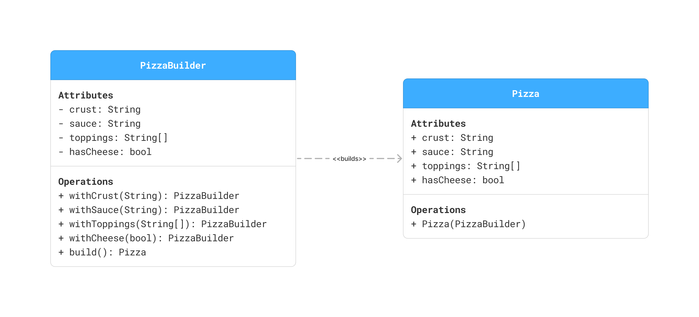
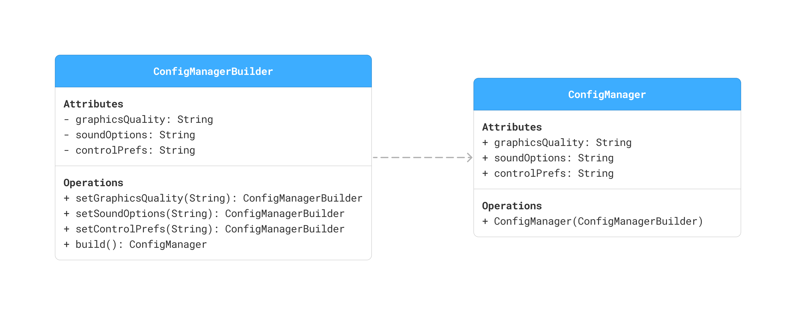
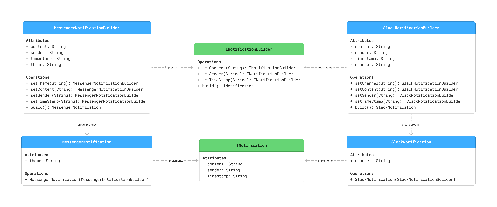

## 🧭 Classic Concrete Builder without Interface - Pizza & Game Engine examples
✅ Best for:
- Building a single, well-defined product.
- Internal project models where flexibility isn’t a concern.

## 🧭 Interface-based Builder - Notification example
✅ Best for:
- Scenarios where you have multiple similar but distinct products (e.g., Slack vs Messenger notifications).
- A system that benefits from treating builders uniformly (e.g., processing in a pipeline).
